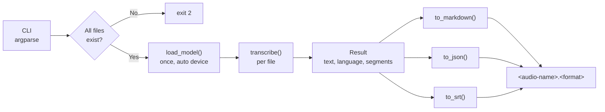

# ScribeFlow | Local AI Transcription Engine

A command-line tool that turns audio into Markdown notes, JSON, or SRT subtitles using OpenAI's Whisper, **running entirely on your own machine**. Nothing is uploaded, which makes it suitable for sensitive recordings such as consultations, interviews, and meetings.


-brightgreen)


---

## Table of Contents

1. [Overview](#1-overview)
2. [How It Works](#2-how-it-works)
3. [Requirements](#3-requirements)
4. [Installation](#4-installation)
5. [Usage](#5-usage)
6. [Output Formats](#6-output-formats)
7. [Choosing a Whisper Model](#7-choosing-a-whisper-model)
8. [Project Structure](#8-project-structure)
9. [Using It From Python](#9-using-it-from-python)
10. [Testing](#10-testing)
11. [Privacy and Responsible Use](#11-privacy-and-responsible-use)
12. [Roadmap](#12-roadmap)
13. [License](#13-license)

---

## 1. Overview

| Feature | Detail |
|---|---|
| Local inference | Whisper runs on your CPU, or on a CUDA GPU automatically when one is present |
| Batch mode | Pass several files; the model is loaded **once** and reused |
| Three output formats | Markdown note (with timeline), JSON (with timed segments), SRT subtitles |
| Model choice | `tiny` through `large` and `turbo`, chosen with `--model` |
| Script-friendly | Exit codes: `0` success, `1` a file or the model failed, `2` bad input |
| Decoupled design | Transcription returns raw data; formatters turn it into output. New formats don't touch the model code. |

---

## 2. How It Works



- **Device selection.** `pick_device()` uses `--device` if given, otherwise CUDA when `torch.cuda.is_available()`, otherwise CPU. FP16 is turned on only for CUDA, which avoids Whisper's CPU warning.
- **Failure handling.** Missing files are reported before the model loads, so you don't wait for a load just to hit a typo. In a batch, a file that fails to decode is reported and skipped; the rest are still written, and the exit code is `1`.

---

## 3. Requirements

- Python 3.9+
- [ffmpeg](https://ffmpeg.org/) on your `PATH` (Whisper uses it to decode audio)
- About 1 GB of RAM/VRAM for `base`; more for larger models (see [section 7](#7-choosing-a-whisper-model))
- Optional: an NVIDIA GPU with CUDA for much faster transcription

---

## 4. Installation

### 4.1 Install ffmpeg

```bash
# Windows
winget install ffmpeg
# macOS
brew install ffmpeg
# Debian / Ubuntu
sudo apt install ffmpeg
```

### 4.2 Clone and install

```bash
git clone https://github.com/JoshuaOmosa/ScribeFlow.git
cd ScribeFlow
python -m venv venv
source venv/bin/activate          # Windows: .\venv\Scripts\activate
pip install -r requirements.txt
```

For GPU support, install the CUDA build of PyTorch from [pytorch.org](https://pytorch.org/get-started/locally/) **before** running the line above.

### 4.3 First run downloads the model

The first time a model is used, Whisper downloads its weights (about 140 MB for `base`) into `~/.cache/whisper`. After that, everything works offline.

---

## 5. Usage

```text
python src/transcriber.py AUDIO [AUDIO ...] [-m MODEL] [-f {md,json,srt}]
                          [-o OUT_DIR] [--device {cpu,cuda}] [--language LANG] [--title TITLE]
```

```bash
# Transcribe the bundled sample to data/input/sample.md
python src/transcriber.py data/input/sample.mp3

# A batch, as JSON, into a separate folder, with a bigger model
python src/transcriber.py visit1.mp3 visit2.wav -m small -f json -o data/output

# Subtitles for a lecture, forcing English
python src/transcriber.py lecture.m4a -f srt --language en

# A titled clinical note
python src/transcriber.py consult.mp3 --title "Consultation Note"
```

Console output:

```text
Loaded Whisper 'base' on cpu
Wrote data/input/sample.md
```

| Option | Default | Meaning |
|---|---|---|
| `-m, --model` | `base` | Whisper model size |
| `-f, --format` | `md` | `md`, `json`, or `srt` |
| `-o, --out-dir` | next to each audio file | Output folder (created if missing) |
| `--device` | auto | Force `cpu` or `cuda` |
| `--language` | auto-detect | e.g. `en`, `sw`, `fr`. Skips detection and is slightly faster |
| `--title` | `Transcript` | Heading for Markdown and JSON output |

---

## 6. Output Formats

Using the bundled 8-second sample. The text is real Whisper `base` output; the segment timings below are illustrative.

**Markdown** (`-f md`)

```markdown
# Transcript

**Language:** en

## Transcript

Why shouldn't you put a toaster in a bathtub full of water? Because your toast would get soggy. Yeah!

## Timeline

- `00:00:00` Why shouldn't you put a toaster in a bathtub full of water?
- `00:00:04` Because your toast would get soggy. Yeah!
```

**JSON** (`-f json`)

```json
{
  "title": "Transcript",
  "language": "en",
  "text": "Why shouldn't you put a toaster in a bathtub full of water? Because your toast would get soggy. Yeah!",
  "segments": [
    { "start": 0.0, "end": 4.0, "text": "Why shouldn't you put a toaster in a bathtub full of water?" },
    { "start": 4.0, "end": 8.5, "text": "Because your toast would get soggy. Yeah!" }
  ]
}
```

**SRT** (`-f srt`)

```text
1
00:00:00,000 --> 00:00:04,000
Why shouldn't you put a toaster in a bathtub full of water?

2
00:00:04,000 --> 00:00:08,500
Because your toast would get soggy. Yeah!
```

Segment boundaries come from Whisper and vary slightly between models.

---

## 7. Choosing a Whisper Model

Larger models are more accurate but slower and need more memory. Approximate figures from the Whisper project:

| Model | Parameters | Approx. VRAM | Relative speed |
|---|---|---|---|
| `tiny` | 39 M | ~1 GB | ~10x |
| **`base`** (default) | 74 M | ~1 GB | ~7x |
| `small` | 244 M | ~2 GB | ~4x |
| `medium` | 769 M | ~5 GB | ~2x |
| `large` | 1550 M | ~10 GB | 1x |
| `turbo` | 809 M | ~6 GB | ~8x |

`small` is a good step up for accented speech or technical vocabulary. `turbo` gives near-`large` accuracy at much higher speed if you have the VRAM.

---

## 8. Project Structure

```text
ScribeFlow/
├── .github/workflows/tests.yml   # CI: runs the test suite on every push
├── data/input/sample.mp3         # 8.5 s sample recording
├── src/transcriber.py            # CLI, transcription, and formatters
├── tests/test_transcriber.py     # 10 tests with a stubbed Whisper
├── requirements.txt
├── LICENSE
└── README.md
```

---

## 9. Using It From Python

```python
import sys
sys.path.insert(0, "src")
from transcriber import load_model, transcribe, to_json

model, device = load_model("small")          # load once
for path in ["a.mp3", "b.mp3"]:
    result = transcribe(model, path, device)
    print(to_json(result, title=path))
```

Adding a format is one function and one registry entry:

```python
def to_txt(result, title="Transcript"):
    return result["text"].strip() + "\n"

FORMATTERS["txt"] = to_txt
```

---

## 10. Testing

```bash
python -m unittest discover -s tests -v
```

The tests replace the `whisper` module with a stub, so they run in well under a second with no PyTorch or model download. They cover:

- All three formatters, including SRT timestamps past one hour and results with no segments
- Missing files exit with `2` **before** the model is loaded
- Batch runs load the model exactly once
- FP16 is requested only on CUDA
- One failed file in a batch is reported, the others are still written, and the exit code is `1`

---

## 11. Privacy and Responsible Use

- **Processing is local.** Audio and transcripts stay on your machine. Only the one-time model download uses the network.
- **Get consent** before recording people, and follow the rules that apply to you (e.g. HIPAA, GDPR, workplace policy).
- **Nothing sensitive is committed by default.** The `.gitignore` excludes everything in `data/input/` except the sample, plus `data/output/`.
- **Review the output.** Whisper can mishear names, accents, and medical or technical terms. Don't treat a transcript as a verified clinical or legal record.

---

## 12. Roadmap

- [x] CLI with model, format, device, language, and output options
- [x] Transcription separated from formatting
- [x] JSON and SRT output with timed segments
- [x] GPU auto-detection
- [x] Batch mode with a single model load
- [x] Tests and CI
- [ ] Speaker separation (diarization)
- [ ] Watch-folder mode for automatic transcription
- [ ] Optional summarisation of transcripts with a local LLM

---

## 13. License

MIT. See [LICENSE](LICENSE). Whisper is released by OpenAI under its own MIT license.
