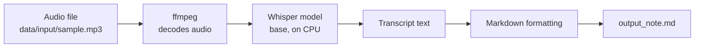
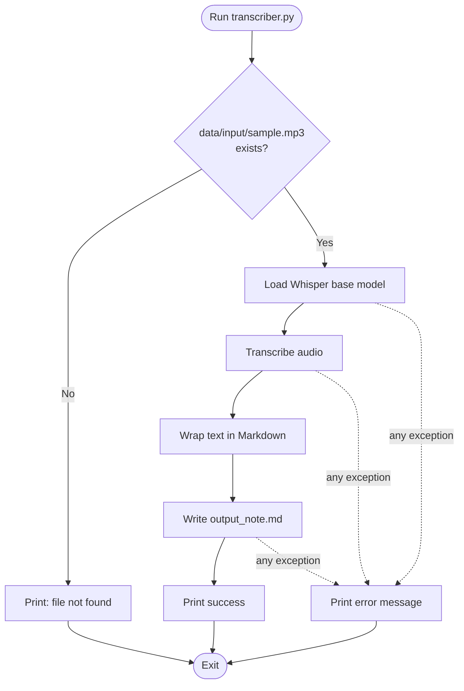
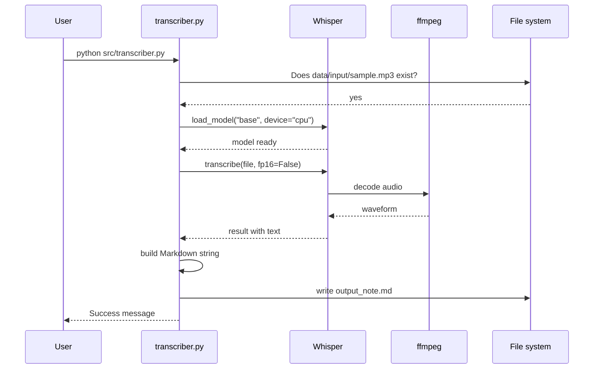
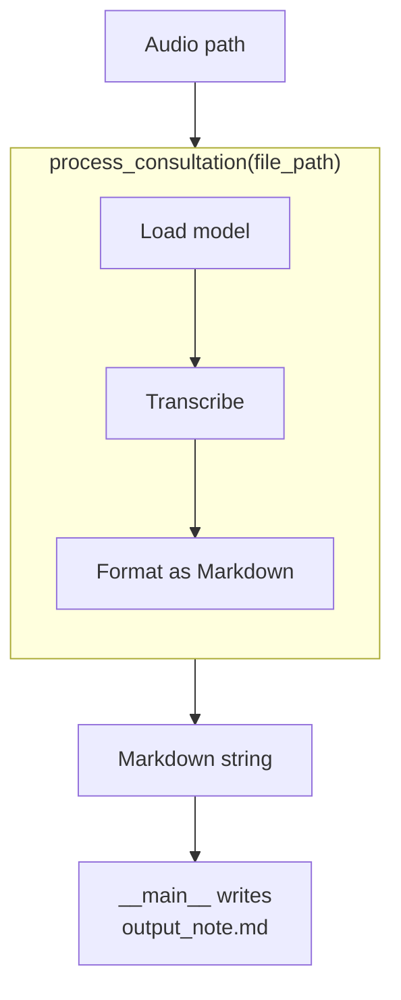
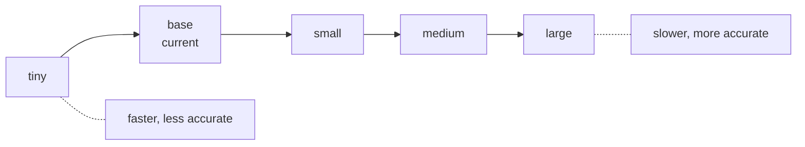
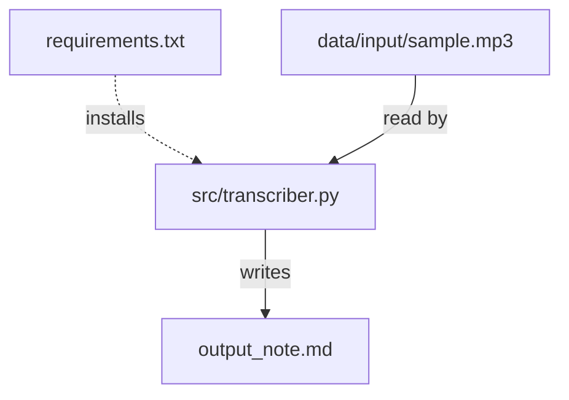
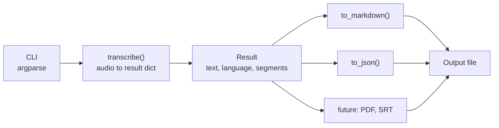
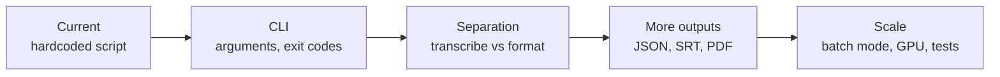

# ScribeFlow | Local AI Transcription Engine

A small Python tool that turns an audio recording into a structured Markdown note using OpenAI's **Whisper** speech-recognition model, running entirely on your own machine.


---

## Table of Contents

1. [Overview](#1-overview)
2. [How It Works](#2-how-it-works)
3. [Requirements](#3-requirements)
4. [Installation](#4-installation)
5. [Usage](#5-usage)
6. [Choosing a Whisper Model](#6-choosing-a-whisper-model)
7. [Project Structure](#7-project-structure)
8. [Code Walkthrough](#8-code-walkthrough)
9. [Configuration Reference](#9-configuration-reference)
10. [Design Notes and Known Limitations](#10-design-notes-and-known-limitations)
11. [Suggested Improvements](#11-suggested-improvements)
12. [Privacy and Responsible Use](#12-privacy-and-responsible-use)
13. [Roadmap](#13-roadmap)
14. [License](#14-license)

---

## 1. Overview

ScribeFlow takes unstructured audio (a consultation, meeting, or voice memo) and produces a readable document. Transcription runs locally with Whisper, so the audio is never sent to a cloud transcription API.

| Feature | Detail |
|---|---|
| Local transcription | Whisper runs on your CPU through PyTorch |
| Structured output | Writes a Markdown note with a title and a Transcript section |
| Simple entry point | One script, `src/transcriber.py`, and a bundled sample recording |
| Wide format support | Whisper decodes audio through `ffmpeg`, so MP3, WAV, M4A and similar formats work |

---

## 2. How It Works

### 2.1 Big picture



### 2.2 Execution flow



### 2.3 Step-by-step sequence



### 2.4 What is in the pipeline today

The transcription and formatting steps live together inside one function. This is the current structure, which the roadmap aims to split:



---

## 3. Requirements

- **Python 3.9 or newer** (as stated by the original docs)
- **ffmpeg** available on your `PATH`
- Enough disk space for PyTorch and the Whisper model weights (several GB in total)
- No GPU needed: the script forces CPU inference

Python packages (`requirements.txt`):

```text
openai-whisper
setuptools-rust
torch
torchvision
torchaudio
```

---

## 4. Installation

### 4.1 Install ffmpeg

| OS | Command |
|---|---|
| Windows | `choco install ffmpeg` |
| macOS | `brew install ffmpeg` |
| Ubuntu / Debian | `sudo apt install ffmpeg` |

Confirm it works with `ffmpeg -version`.

### 4.2 Clone and install

```bash
git clone https://github.com/JoshuaOmosa/ScribeFlow.git
cd ScribeFlow

python -m venv venv
source venv/bin/activate        # Linux / macOS
# .\venv\Scripts\activate       # Windows

pip install -r requirements.txt
```

### 4.3 First run downloads the model

The first time the script loads the `base` model, Whisper downloads its weights (roughly 140 MB) and caches them locally, by default under `~/.cache/whisper`. That download needs an internet connection. After it is cached, transcription works offline.

---

## 5. Usage

Run the script **from the project root**:

```bash
python src/transcriber.py
```

It transcribes `data/input/sample.mp3` and writes `output_note.md` in the current directory.

Console output:

```text
--- Loading Model (Base) ---
--- Transcribing: data/input/sample.mp3 ---

✅ Success: Generated output_note.md
```

### Sample input and output

The bundled `data/input/sample.mp3` is an 8.5-second stereo recording (44.1 kHz, about 340 KB). The committed `output_note.md` shows the result:

```markdown
# Consultation Note

## Transcript
 Why shouldn't you put a toaster in a bathtub full of water? Because your toast would get soggy. Yeah!
```

### Transcribing your own file

The input path is currently hardcoded, so edit this line at the bottom of `src/transcriber.py`:

```python
input_file = "data/input/sample.mp3"
```

Point it at your own recording, or use the improved command-line version in [section 11](#11-suggested-improvements).

### Using the function from other code

```python
import sys
sys.path.insert(0, "src")
from transcriber import process_consultation

note = process_consultation("data/input/sample.mp3")
print(note)
```

Each call reloads the model, so for batches it is faster to load once and reuse it.

---

## 6. Choosing a Whisper Model

The script uses `base`. Larger models are more accurate but slower and need more memory. Approximate figures from the Whisper project's documentation (verify against the current docs before relying on them):

| Model | Parameters | Approx. VRAM | Relative speed |
|---|---|---|---|
| `tiny` | 39 M | ~1 GB | fastest (~10x) |
| **`base`** | **74 M** | **~1 GB** | **~7x** |
| `small` | 244 M | ~2 GB | ~4x |
| `medium` | 769 M | ~5 GB | ~2x |
| `large` | 1550 M | ~10 GB | 1x |
| `turbo` | 809 M | ~6 GB | ~8x (recent versions only) |

English-only variants (for example `base.en`) also exist and can be slightly better for English audio.



To switch models today, change `"base"` in this line of `process_consultation`:

```python
model = whisper.load_model("base", device="cpu")
```

---

## 7. Project Structure

```text
ScribeFlow/
├── readme.md
├── requirements.txt
├── output_note.md              # Example output (committed)
├── data/
│   └── input/
│       └── sample.mp3          # Example recording (8.5 s)
└── src/
    └── transcriber.py          # Transcription and formatting
```



---

## 8. Code Walkthrough

### `src/transcriber.py`

```python
import whisper
import os
import warnings

warnings.filterwarnings("ignore", message="FP16 is not supported on CPU")

def process_consultation(file_path):
    model = whisper.load_model("base", device="cpu")
    result = model.transcribe(file_path, fp16=False)

    formatted_note = f"# Consultation Note\n\n## Transcript\n{result['text']}\n"
    return formatted_note

if __name__ == "__main__":
    input_file = "data/input/sample.mp3"

    if os.path.exists(input_file):
        try:
            note = process_consultation(input_file)
            with open("output_note.md", "w", encoding="utf-8") as f:
                f.write(note)
        except Exception as e:
            print(f"An error occurred: {e}")
    else:
        print(f"File not found at {input_file}")
```

(Print statements shortened here.)

| Part | What it does |
|---|---|
| `warnings.filterwarnings` | Hides Whisper's "FP16 is not supported on CPU" warning |
| `whisper.load_model("base", device="cpu")` | Loads the base model onto the CPU, downloading it on first use |
| `model.transcribe(file_path, fp16=False)` | Decodes the audio and returns a dict; `fp16=False` uses 32-bit math, which CPUs require |
| `result['text']` | The full transcript as one string |
| `formatted_note` | An f-string that adds the Markdown title and section header |
| `__main__` block | Checks the file exists, runs the pipeline, writes `output_note.md` in UTF-8 |

Whisper's result also contains `language` and a list of timestamped `segments`. The current script uses only `text`.

---

## 9. Configuration Reference

Everything is a literal in code; there are no flags or config files yet.

| Setting | Value | Where |
|---|---|---|
| Model | `base` | `process_consultation` |
| Device | `cpu` | `process_consultation` |
| FP16 | `False` | `process_consultation` |
| Input file | `data/input/sample.mp3` | `__main__` block |
| Output file | `output_note.md` | `__main__` block |
| Note title | "Consultation Note" | `process_consultation` |
| Output encoding | UTF-8 | `__main__` block |

---

## 10. Design Notes and Known Limitations

I compiled the script and ran its control flow with Whisper replaced by a small stand-in module, so the file handling, formatting, and error paths are verified. I did not run real transcription (it needs PyTorch and a model download), so accuracy and speed are not measured here. The bundled `output_note.md` is the real Whisper output from your machine.

Where the code differs from earlier documentation:

- **Model choice is not switchable.** Earlier docs said you can easily switch between `base`, `small`, `medium`, and `large`. The model name is hardcoded; you have to edit the source.
- **Transcription and formatting are not decoupled.** Earlier docs described a separate formatting layer. Both happen inside `process_consultation`, and JSON or PDF output does not exist yet.
- **GPU is not used.** Docs mention "CPU/GPU", but the code passes `device="cpu"` and `fp16=False`, so a GPU is never used even if present.
- **"All processing is local" needs a caveat.** Inference is local, but installing packages and the first model load require internet access.

Other behavior to know about:

- **The input path is hardcoded and relative to your working directory.** Running the script from any folder other than the project root prints "File not found" (I confirmed this).
- **Failures still exit with status 0.** A missing file and an exception both print a message but do not signal failure to scripts or CI.
- **Leading space in the transcript.** Whisper's text begins with a space and the script does not strip it, so the output has a stray space after `## Transcript` (visible in `output_note.md`).
- **Only plain text is kept.** Timestamps, language detection, and segments are discarded, and there is no speaker separation.
- **The model reloads on every call.** Fine for one file, wasteful for batches.
- **`requirements.txt` is unpinned and heavier than needed.** `torchvision` is not used for audio, and `setuptools-rust` is a build helper. Unpinned versions can break future installs.
- **The output is always titled "Consultation Note"**, whatever the audio contains.
- **Redundant warning filter.** With `fp16=False` the FP16 warning is not raised, so the filter is unnecessary.
- **No `.gitignore`.** Generated output and audio can be committed by accident (see [section 12](#12-privacy-and-responsible-use)).
- **README defects.** The previous readme had a malformed clone command (`git clone (https://...)` with parentheses), ended mid-code-block, and had no usage section. This document replaces it.
- **No tests and no LICENSE file.**

---

## 11. Suggested Improvements

A version that adds a command-line interface, model selection, GPU auto-detection, a real separation between transcription and formatting, JSON output, proper exit codes, and transcript trimming. I ran it with the stand-in Whisper module to confirm the interface and outputs.

```python
import argparse
import json
import sys
from pathlib import Path
from typing import Optional

MODELS = ["tiny", "base", "small", "medium", "large", "turbo"]


def transcribe(path: Path, model_name: str = "base", device: Optional[str] = None) -> dict:
    """Run Whisper and return its raw result (text, language, segments)."""
    import torch
    import whisper

    device = device or ("cuda" if torch.cuda.is_available() else "cpu")
    model = whisper.load_model(model_name, device=device)
    return model.transcribe(str(path), fp16=(device == "cuda"))


def to_markdown(result: dict) -> str:
    return f"# Consultation Note\n\n## Transcript\n{result['text'].strip()}\n"


def to_json(result: dict) -> str:
    payload = {
        "language": result.get("language"),
        "text": result["text"].strip(),
        "segments": [
            {"start": s["start"], "end": s["end"], "text": s["text"].strip()}
            for s in result["segments"]
        ],
    }
    return json.dumps(payload, indent=2, ensure_ascii=False) + "\n"


FORMATTERS = {"md": to_markdown, "json": to_json}


def main() -> int:
    parser = argparse.ArgumentParser(description="Transcribe audio locally with Whisper.")
    parser.add_argument("audio", type=Path, help="path to an audio file")
    parser.add_argument("--model", choices=MODELS, default="base")
    parser.add_argument("--format", choices=FORMATTERS, default="md")
    parser.add_argument("--output", type=Path,
                        help="output file (default: output_note.<format>)")
    args = parser.parse_args()

    if not args.audio.is_file():
        print(f"Error: file not found: {args.audio}", file=sys.stderr)
        return 2

    output = args.output or Path(f"output_note.{args.format}")
    try:
        result = transcribe(args.audio, args.model)
        output.write_text(FORMATTERS[args.format](result), encoding="utf-8")
    except Exception as e:
        print(f"Error: {e}", file=sys.stderr)
        return 1
    print(f"Wrote {output}")
    return 0


if __name__ == "__main__":
    sys.exit(main())
```

Usage:

```bash
python src/transcriber.py data/input/sample.mp3
python src/transcriber.py meeting.wav --model small --format json --output meeting.json
```

### Target architecture



Adding a new output format now means adding one function and one dictionary entry, with no changes to the transcription code. The `turbo` model name requires a recent `openai-whisper` release.

### Smaller fixes

| Problem | Fix |
|---|---|
| Heavy, unpinned dependencies | Drop `torchvision`, pin versions, and consider `pip freeze` output |
| Silent failure exit codes | Return 1 or 2 on errors (done above) |
| Stray leading space | `.strip()` the text (done above) |
| Accidental commits of recordings | Add a `.gitignore` (below) |

```text
# .gitignore
venv/
__pycache__/
data/input/*
!data/input/sample.mp3
output_note.*
```

---

## 12. Privacy and Responsible Use

Local processing is a real privacy advantage, and the project is built around it. A few practical points:

- Recordings such as medical consultations, legal meetings, or interviews often contain sensitive personal information. Get consent before recording and follow the rules that apply to you (for example HIPAA, GDPR, or workplace policy).
- The transcript is written to a plain-text file in the project folder. Because the repository has no `.gitignore`, `output_note.md` and anything in `data/input/` can be committed and pushed by accident. Use the ignore rules in section 11 before working with real recordings.
- Whisper can make mistakes, especially with accents, background noise, names, and medical or technical terms. Review transcripts before relying on them, and never treat the output as a verified clinical or legal record.

---

## 13. Roadmap



- [ ] Accept the audio path, model, and output path as arguments
- [ ] Split transcription from formatting
- [ ] Add JSON and subtitle (SRT) output using Whisper's segments
- [ ] Auto-detect and use a GPU
- [ ] Load the model once for batch processing
- [ ] Pin and slim down `requirements.txt`
- [ ] Add a `.gitignore`
- [ ] Add tests with a stubbed model
- [ ] Optional: speaker separation and timestamps in the note
- [ ] Add a LICENSE

---

## 14. License


Whisper is released by OpenAI under its own license; check its repository for terms.
